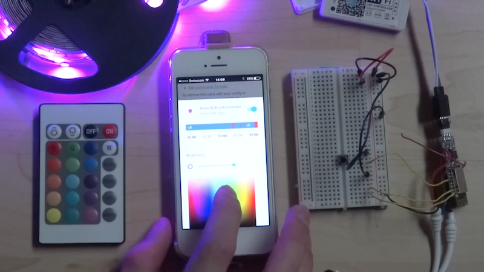

# Arilux AL-LC0X LED controller
## Alternative firmware
Alternative firmware for Arilux AL-LC0X LED controllers, based on the MQTT protocol and a TLS connection.
The LED controller is a cheap product commercialized by [Banggood.com](http://www.banggood.com/ARILUX-AL-LC03-Super-Mini-LED-WIFI-APP-Controller-Remote-Control-For-RGB-LED-Strip-DC-9-12V-p-1060223.html) and can be easily reprogrammed.

This firmware was tested with the Arilux AL-LC03 (IR remote) and the Arilux AL-LC09 (RF remote) models.


## Features
- Remote control over the MQTT protocol
- Remote control over IR codes (`#define IR_REMOTE` uncomment)
- Remote control over RF codes (`#define RF_REMOTE`uncomment)
- TLS support (`#define TLS`uncomment)
- Debugging over Telnet (`#define DEBUG_TELNET` uncomment)
- Native support for Home Assistant

## Demonstration

[](https://www.youtube.com/watch?v=IKh0inaLvAU "Arilux AL-LC03 + IR + MQTT + Home Assistant")

## Flash the firmware
### Schematic
- VCC (Arilux) -> VCC (3.3 [V])
- RX  (Arilux) -> TX  (FTDI)
- TX  (Arilux) -> RX  (FTDI)
- GPIO0 (Arilux) -> GND (FTDI)
- GND (Arilux) -> GND (FTDI)

Note: To enter in programming mode, you need to put GPIO0 to LOW while powering the board. It's not possible to reprogram the module without soldering the wire to the ESP8266 module.

ESP-12F layout: [https://cdn.solarbotics.com/products/photos/ec129f72948c266ec1502ae5a4d514ba/29240-IMG_0808.jpg](https://cdn.solarbotics.com/products/photos/ec129f72948c266ec1502ae5a4d514ba/29240-IMG_0808.jpg)

The FTDI from the left gives power and it's connected to an USB charger (VCC, GND). The FTDI from the right is connected to the computer and is used to reprogram the ESP8266 (RX, TX, GND).


### Settings for the Arduino IDE

| Parameter       | Value                    |
| ----------------|--------------------------|
| Board           | Generic ESP8266 Module   |
| Flash Mode      | DIO                      |  
| Flash Frequency | 40 MHz                   |  
| Upload Using    | Serial                   |  
| CPU Frequency   | 80 MHz                   |  
| Flash Size      | 512K (64K SPIFFS)        |  
| Reset Method    | ck                       |  
| Upload Speed    | 115200                   |  
| Port            | COMX, /dev/ttyUSB0, etc. |

## Control
### IR
The LED controller can be controlled with the IR remote included with the Arilux AL-LC03. The functionalities `Flash`, `Strobe`, `Fade` and `Smooth`are not implemented yet.

### RF
The LED controller can be controlled with the RF remote included with the Arilux AL-LC09. The functionalities `Mode+`, `Mode-`, `Speed+`, `Speed-` and `toggle`are not implemented yet.

### MQTT
State

| #          | Topic                 | Payload   |
|------------|-----------------------|-----------|
| State      | `arilux/state/state`  | `ON`/`OFF`|
| Command    | `arilux/state/set`    | `ON`/`OFF`|

Brightness

| #          | Topic                      | Payload   |
|------------|----------------------------|-----------|
| State      | `arilux/brightness/state`  |  `0-255`  |
| Command    | `arilux/brightness/set`    |  `0-255`  |

Color

| #          | Topic                 | Payload             |
|------------|-----------------------|---------------------|
| State      | `arilux/color/state`  | `0-255,0-255,0-255` |
| Command    | `arilux/color/set`    | `0-255,0-255,0-255` |

### Configuration for Home Assistant
configuration.yaml
```yaml
mqtt:
  broker: 'm21.cloudmqtt.com'
  username: '[REDACTED]'
  password: '[REDACTED]'
  port: '[REDACTED]'

light:
  - platform: mqtt
    name: 'Arilux RGB Led Controller'
    state_topic: 'arilux/state/state'
    command_topic: 'arilux/state/set'
    brightness_state_topic: 'arilux/brightness/state'
    brightness_command_topic: 'arilux/brightness/set'
    rgb_state_topic: 'arilux/color/state'
    rgb_command_topic: 'arilux/color/set'
```

## Todo
### IR remote
- Flash
- Strobe
- Fade
- Smooth

### RF remote
- Mode+
- Mode-
- Speed+
- Speed-
- Toggle

## Licence
> THE SOFTWARE IS PROVIDED "AS IS", WITHOUT WARRANTY OF ANY KIND, EXPRESS OR
  IMPLIED, INCLUDING BUT NOT LIMITED TO THE WARRANTIES OF MERCHANTABILITY,
  FITNESS FOR A PARTICULAR PURPOSE AND NONINFRINGEMENT. IN NO EVENT SHALL THE
  AUTHORS OR COPYRIGHT HOLDERS BE LIABLE FOR ANY CLAIM, DAMAGES OR OTHER
  LIABILITY, WHETHER IN AN ACTION OF CONTRACT, TORT OR OTHERWISE, ARISING FROM,
  OUT OF OR IN CONNECTION WITH THE SOFTWARE OR THE USE OR OTHER DEALINGS IN THE
  SOFTWARE.

## Home Assistant Community Discussion Forum
For further information and to join the discussion for this firmware please go to the Home Assistant Community Discussion Forum [Alternative firmware for Arilux AL-LC03 for use with MQTT and Home Assistant](https://community.home-assistant.io/t/alternative-firmware-for-arilux-al-lc03-for-use-with-mqtt-and-home-assistant-rgb-light-strip-controller/6328/16). I would be happy to answer any of your queries there.

## Contributor
- [KmanOz](https://github.com/KmanOz) : Codes for the RF remote (Arilux AL-LC09)

*If you like the content of this repo, please add a star! Thank you!*
